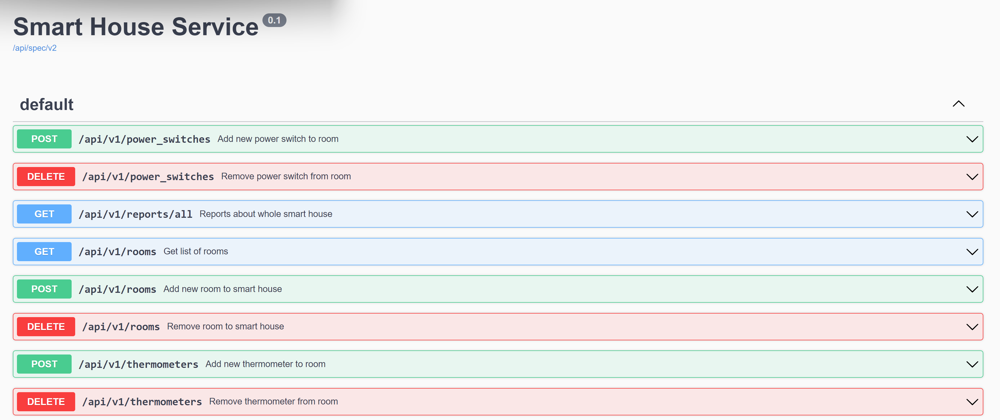

# Smart House Service

## Требования

Для работы приложения в системе должен быть установлен `docker` и `docker-compose`.

## Инструкции

Перед использованием приложения необходимо запустить базу данных одной из следующих комманд:

* `make db_up`
* `docker-compose up -d`

Доступное API приложения можно посмотреть по ссылке `http://127.0.0.1:6537/docs`

Для запуска тестов можно воспользоваться одной из следующих комманд:

* `make test`
* `cargo test --test api`

Для запуска примера нужно запустить приложение, а затем запустить пример одной из следующих комманд:

* `make example_report`
* `cargo run --example report`